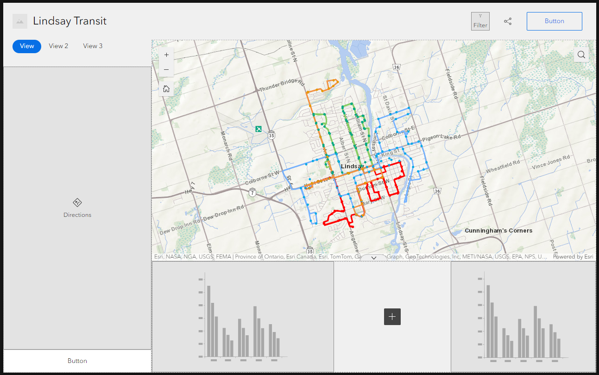

# Geom99 Group Project

In this log:

- [x] Project Overview (15/03/24 | 5 mins)
- [x] Finding Lindsay transit data (20/03/24 | 10 mins)
- [x] Uploading Lindsay transit data to ArcGIS Online (15/03/24 | 15 mins)
- [x] Exploring ArcGIS Hub (Part 1) (19/03/24 | 15 mins)
- [x] Exploring Public Transit Toolbox in ArcGIS Pro (20/03/24 | 30 mins)
- [x] Exploring Mapbox as a web solution (21/03/24 | 30 mins)
- [x] Exploring OpenStreetMap as a web solution (22/03/24 | 30 mins)
- [x] Using the LIO Basemap (22/03/24 | 15 mins)
- [x] Exploring other cities' public transit websites (22/03/24 | 15 mins)
- [x] Exploring Experience Builder (Part 1) (22/03/24 | 30 mins)
- [x] Creating CSV files for Lindsay Transit fares (22/03/24 | 5 mins)
- [x] Exploring ArcGIS Hub (Part 2) (22/03/24 | 15 mins)
- [x] Exploring Experience Builder (Part 2) (27/03/24 | 60 mins)
- [x] Exploring Experience Builder (Part 3) (28/03/24 | 90 mins)
- [x] Exploring Leaflet (Part 1) (02/04/24 | 30 mins)
- [x] Exploring past group projects on Luna server and templates (02/04/24 | 30 mins)
- [x] Exploring Leaflet (Part 2) (03/04/24 | 30 mins)
- [x] Convert shapefiles to GeoJSON (03/04/24 | 30 mins)
- [x] Preparing the final Experience Builder (Part 1) (08/04/24 | 60 mins)
- [x] References

Total Duration: 8 hrs 5 mins

> [!NOTE]
> These times reflect the amount of time it will take to go through the task here on GitHub. 
> To see the hours I put into completing these tasks for the first time, please see my timesheet.

---

## Project Overview

#### About the Project

A group of four GIS students are exploring web solutions to find a user-friendly web application that will best help the general public navigate around Lindsay, Ontario, through public transportation.

#### Lindsay Transit Map

Kawartha Lakes. (2024). Lindsay transit. https://www.kawarthalakes.ca/en/living-here/resources/Transit/COKL-Transit-Map-2023.pdf 

#### Four Bus Routes

- Orange (new as of Feb 2023)
- Green
- Red
- Blue

#### Bus Schedule

Kawartha Lakes. (2024). Lindsay transit. https://www.kawarthalakes.ca/en/living-here/lindsay-transit.aspx

---

## Finding Lindsay transit data

- One group member already acquired the data
- I did some more searching and found where the hub of real-time data is

### Transitland

URL: https://www.transit.land/feeds/f-kawartha~on~ca

#### About 

- stores the GTFS feed for Lindsay transit
- has current static data, but it is not up to date
	- this dataset is missing the orange transit line, which was added to the routes in Feb 2024
- have to make a free account to download the data
- nearly every day the feed is posted

> [!NOTE]
> I tried requesting an account to download the data, but received no confirmation email, so I am not able to sign in.
> We may have to just continue with older data for the time being.

---

## Uploading Lindsay transit data to ArcGIS Online

Learn how to download public data from an ArcGIS Hub and upload it to ArcGIS Online as a hosted feature service

Assumption(s):
- User has an ArcGIS Account

Duration: 15 mins

### Steps

1. Visit the public **ArcGIS Hub** where Lindsay transit data are located: https://hub.arcgis.com/documents/ca68660b0e3e47a09a667d2f0963df99/about 

2. Browse the available data under **You may be interested in**.

3. Click ```Bus Routes``` feature service to bring you to an overview of its service.

4. Click ```Download``` to bring you to a list of **Download Options**.

5. In this case, we want the **Shapefile**. Find the shapefile on the list, click ```Download```. The zipfile including all shapefile data will automatically start downloading to the computer.

> [!IMPORTANT]
> Keep the folder zipped! ArcGIS Online will want you to upload a new item in a zipped file.

6. In a separate browser, sign into **ArcGIS Online**: https://www.arcgis.com/index.html# 

7. Once signed in, click ```Content```.

8. To keep files organized, on the lefthand side, click the ```folder icon``` next to **Folders** to create a new folder, where you will be storing the new items.

9. When in the folder, click ```New item``` at the top lefthand side of the page.

10. Drag and drop the zipped folder onto the page. AGOL will show that it is recognizes the uploaded folder was a **shapefile**.

11. We want the **zipped folder** AND the **hosted feature layer**, so select ```Add ___.zip and create a hosted feature layer```. Click ```Next```.

12. Give your shapefile a proper **name** and click ```Save```.

13. The shapefile will now appear in your AGOL with its associated hosted feature layer!

14. Repeat all steps for Lindsay's Bus Stops

:tada: *Congratulations! You have now learned how to upload the Lindsay, Ontario, transit data to ArcGIS Online*

> [!TIP]
> Click the hosted feature layer and view in Map Viewer to see the data on a map.

> [!WARNING]
> After further inspection of the data, it was discovered that some bus stops were missing. Further processing must be done to ensure the general public can rely on the data to navigate around the city.

---

## Exploring ArcGIS Hub (Part 1)

Learn the functionalities of ArcGIS Hub and explore it to see if it is a possible web solution

Duration: 15 mins

### What is ArcGIS Hub?

- Application that you can use to easily build a website 
- Customize the website to be able to share ArcGIS Online content internally or with the public

### Advantages and disadvantages of ArcGIS Hub

| Advantages  | Disadvantages  |
| ------------- | ------------- |
| Easy to use, drag and drop items  | Need credits to store and process data^  |
| Included with Basic ArcGIS Online Account  | Moving things around the page can be finicky   | 
| Can customize the theme/look of the hub  |   |

^More on credits: https://doc.arcgis.com/en/arcgis-online/administer/credits.htm

### Things to consider before creating your Hub

- What is the purpose of your Hub?
- Who is your audience? 
- Who will be able to access the data in your hub?
- What theme do you want your Hub to follow (e.g., colors, images, fonts, etc.)

### Would Hub be useful for our group project?

- **Yes**, non-GIS users will be able to navigate through the site
- **Yes**, you don't need a lot of coding experience to use this web solution
- **Yes**, it is part of ArcGIS Online, so Fleming can host it for the public
- **No**, our purpose isn't to share the data with the public, just display it, so not sure if this is the best option for us

---

## Exploring Public Transit Toolbox in ArcGIS Pro

Learn about the capabilities of the Public Transit Toolbox in ArcGIS Pro

Duration: 30 mins

### What is the Public Transit Toolbox?

- Toolbox in ArcGIS Pro that is used for displaying, converting, editing, and analyzing public transit data
- In this toolbox, there is an analysis toolset and a conversion toolset
	- analysis toolset used to analyze public transit data
	- conversion toolset used to convert to/from GTFS datasets

### Why is this toolbox of interest to our project?

- Since our group is working with public transit data, we decided to explore the tools within this toolbox
- We have GTFS Lindsay transit data, which can be processed using these tools

### GTFS to Public Transit Data Model

Learn how to use the **General Transit Feed Specification (GTFS) to Public Transit Data Model** tool to convert the GTFS data to a set of feature classes and tables that represent the transit data

Assumption(s):
- You have an ArcGIS Account with access to ArcGIS Pro and ArcGIS Online
- You already have the GTFS csv files downloaded

Duration: 30 mins

#### Steps

1. Open up a new project map in ArcGIS Pro. Save the project in a directory of your choice.

2. In the **Catalog Pane**:
    - Right click on ```Folders```
    - Click ```Add Folder Connection```
    - Navigate to the folder where your CSV files are saved on your local computer
	- Click ```OK```.
	- Expand the newly connected folder to see its contents

3. Once the folder connection is made, click the ```Analysis``` tab:
	- Click ```Environments```
	- Click the globe next to **Output Coordinate System**
	- Choose Coordinate System **NAD 1983 CSRS UTM ZONE 17N**
	- Click ```OK```

4. In the **Catalog Pane**:
	- Right click on your **geodatabase**
	- Click ```New```
	- Click ```Feature Dataset```
	- Ensure the **Output Geodatabase** is the one you’d like to store it in
	- Give the feature dataset a meaningful **name**
	- Ensure the **coordinate system** is the same one set in the environments
	- Click ```Run```

5. Click the ```Analysis``` tab 

6. Click ```Tools```

7. In the **Toolboxes** directory:
	- Click ```Public Transit Tools``` to expand the toolbox
	- Click ```Conversion``` to expand the toolset
	- Click ```GTFS to Public Transit Data Model```
	- This will bring up the **GTFS to Public Transit Data Model** Geoprocessing window

8. In the **Geoprocessing Window**:
	- For **Input GTFS Folders**, find the folder that olds your csv files
	- For **Target Feature Dataset**, choose the newly made feature dataset
	- Leave all other defaults
	- Click ```Run```

> [!NOTE]
> The target feature dataset chosen must not already have public transit data model feature classes within it.
> If the geodatabase being used is enterprise, it must not be versioned.

9. The feature classes and table will automatically be added to the map.

10. Explore the new data

| Item  | Type  | Location  | Description  |
| ------------- | ------------- | ------------- | ------------- |
| LineVariantElements  | Line  | Feature Dataset  | shows the route of the transit vehicle  |
| Stops  | Point  | Feature Dataset  | shows the bus stops  |
| CalendarExceptions  | Table  | Geodatabase  | ServiceID, ExceptionDate, ExceptionType |
| Calendars  | Table  | Geodatabase  | Empty; shows GServiceID, days of the week, StartDate and EndDate  |
| Lines  | Table  | Geodatabase  | shows 4 bus routes and route type  |
| LineVariants  | Table  | Geodatabase  | shows 4 bus routes; no direction data  |
| Runs  | Table  | Geodatabase  | TripID, CalendarID; wheelchair and bike columns null  |
| ScheduleElements  | Table  | Geodatabase  | ScheduleID and departure/arrivals |
| Schedules  | Table  | Geodatabase  | shows LineVarID  |

11. Suggestions for further exploration:

- Can schedule data be added to the tables?
- What type of calendar exceptions are they?
- Can we determine how long it will take to go from one stop to another?
- What other tools in the Public Transit toolbox might be useful for our project?

> [!NOTE]
> I've prepared a Word document to share with my group members outlining the steps and results from this task.
> The document has been uploaded to our Group on ArcGIS Online.

---

## Exploring Mapbox as a web solution

Learn the functionalities of Mapbox and explore it to see if it is a possible web solution to our group project

Duration: 40 mins

### What is Mapbox?

- Mapping and location platform for creating and customizing maps
- Uses APIs and SDKs
- Accounts are free, but many capabilities are not
- Used by many reputable companies (Snapchat, Foursquare, etc.)

### Why is this web solution of interest to our project?

- We need a web solution for our group project
- This web solution has a lot of open-source capabilities, which would make our project available to a wider audience
- Although the product is not free, they may be able to provide free licensing for student projects
- We want to explore the functionalities to see if it is a viable solution to our problem statement

### What are the advantages and disadvantages of Mapbox?

| Advantages  | Disadvantages  |
| ------------- | ------------- |
| The user interface has a "crisp look and feel"  | Many of the capabilities require coding  |
| Pricing is flexible, free tier to start  | There isn't documentation on everything  | 
| Super customizable, using API and SDK  | No ability for field data collection  |
| Augmented reality and storytelling options  | Not completely open source as people believe  |
| Has routing and geocoding processes  | Need to pay to use the services  | 
| Tutorials available to follow  |   |

GISGeography. (2024). Mapbox review: 5 things we like. https://gisgeography.com/mapbox/ 

### 'Getting started with Mapbox Standard in Studio' tutorial

Created a Mapbox account and completed the tutorial 'Getting started with Mapbox Standard in Studio,' which can be found here: https://docs.mapbox.com/help/tutorials/aa-standard-in-studio/

#### What did I do differently?

- Used different font (Poppins instead of Roboto Mono)
- Kept POI labels because I feel that if I were biking, I'd want to know the location of parks
- Removed the transit labels
- Used a different basemap (dusk instead of night)
- Used a different point color (yellow instead of purple)

#### What did I learn?

- Data was added from a GeoJSON file
- The Mapbox Standard interface is very simple and user-friendly
- Emission strength set to 1 means that the feature will appear the same regardless of the basemap style
- 'Slots' allow you to easily order your layers how you want them to appear
    - top: above POI, behind place and transit labels
    - middle: above lines, behind 3D buildings
    - bottom: above polygons
- When you zoom in and alter the direction of the north arrow, the buildings become three-dimensional 
- Publishing is really quick
- You and others can access each other's map styles, if made available to the public

#### Will this be a good web app for our project?

- It'd be neat to view the routes with the three dimensional buildings. This can make travelling easier, as you're able to locate landmarks as you go.
- Need to look more into the capabilities of the free version. Might not have full routing capabilities we are looking for.
- Not everyone in the group is comfortable with coding, so not sure if this is the best application to use.
- Not if we can't get free licensing for student projects.
- In the free account, you have 50,000 free map loads for web - I am assuming we will go beyond this, especially when the map is made available to the public, so Mapbox is not the viable option

#### Final product


> [!NOTE]
> I've prepared a Word document to share with my group members outlining this task.
> The document has been uploaded to our Group on ArcGIS Online and OneDrive.

---

## Exploring OpenStreetMap as a web solution

Learn the functionalities of Mapbox and explore it to see if it is a possible web solution to our group project

Duration: 40 mins

### What is OpenStreetMap (OSM)?

- OSM is a free, open-source web map maintained by the public.

### Why is this web solution of interest to our project?

- We need a web solution for our group project
- This web solution is free and open-sourced
- We want to explore the functionalities to see if it is a viable solution to our problem statement.

### My pros and cons about this web solution

| Advantages  | Disadvantages  |
| ------------- | ------------- |
| Collaborative, any changes you make go live for everyone when saved  | The imagery of the basemap changes depending on the zoom  |
| Very user-friendly  | The buildings and roads don't completely line up  |
| Can edit the map in-browser, without having to download anything  | Cannot do further analysis through OSM, just adding and editing features  |
|   | The data exported isn't just a simple shapefile  |

MapGive. (2014, March 24). Learn how to map in OpenStreetMap [Video]. YouTube. https://www.youtube.com/watch?v=Ir-3K0pjwOI

### Explore OSM interface

Visit https://www.openstreetmap.org/ and either create an account or sign in.

> [!TIP]
> If this is your first time logging in, I highly recommend going through the **Walkthrough** to learn how to create and edit points, straight and curved lines, and rectangular and circular areas (polygons). This YouTube video by MapGive is also a great learning tool: https://www.youtube.com/watch?v=Ir-3K0pjwOI.

### Things to note

- The guided tour when you first create an account is very useful. It covers topics such as creating and editing points, straight and curved lines, and rectangular and circular areas (polygons). It is available at any time, if you have to go back to it.

- When adding features to the map, if you accidentally add two nodes too close together, it lets you know and prompts you to edit, remove, or merge them


- Any changes you make go live the when they are saved. This is neat because it means everyone in the world who adds features is contributing to the data, but this can also have a negative impact on the credibility and accuracy of the existing data. How do we know the data being added is correct?

#### Will this be a good web solution for our project?

- The features in Lindsay, Ontario, don't completely line up with the images, which can be problematic when displaying transit routes.

- Does OSM display transit routes?
	- Yes! Change the map layers to **Transport Map** to see the Lindsay Public Transit Route.
	- **However**, this transit route is not up to date - it is currently missing the Orange transit line, which was added in Feb 2023.


- The data will have to be added to OSM and exported to another application for further processing. 
	- **However**, since this is not a data-focused project, this solution isn't the most efficient one, given our project timeline.

- I tried exporting data, and it downloaded as an .osm file. I need to do further digging into how to process this file in other applications.
	- **However**, again, since this is not a data-focused project, this solution isn't the most efficient one, given our project timeline.

- No analysis can be done on the data within OSM, just simple points, lines, and polygons can be added to the map.

> [!NOTE]
> I've prepared a Word document to share with my group members outlining this task.
> The document has been uploaded to our Group on OneDrive.

---

## Using the LIO Basemap

Learn why it is advantageous for us to use LIO basemap

Duration: 15 mins

### What is LIO?

- LIO = Land Information Ontario
- provides to the public a cached basemap of the province of Ontario in ArcGIS Server

### Why use this basemap?

- it shows the natural and constructed features of Ontario's landscape
- it is constantly being updated
- it is open sourced data, so we can use it in our project
- the feature symbologies are intuitive (e.g., blue = water, known symbols for marsh, road/path networks, etc.)
	- **however**, there is no 
- our study area is Lindsay, Ontario, so its boundaries will be included within the basemap
- the shown features update as you zoom in, showing more or less depending on the zoom level - prevents overcrowding of data
	- **however**, if relying on landmarks to navigate the transit system, this layer probably isn't the most effective for that

### How can you access this basemap?

#### Through Rest API URL

- URL: https://ws.lioservices.lrc.gov.on.ca/arcgis1061a/rest/services/LIO_Cartographic/LIO_Topographic/MapServer
- From here you can see the JavaScript, add it to ArcGIS Online Map Viewer, and other applications
- View the layers that are included in this map service

#### Through ArcGIS Online 

- Access the basemap at the item page on AGOL: https://www.arcgis.com/home/item.html?id=547ee954b12341e0be4f907ed4d06b5d
- From here you can ```Open in Map Viewer``` and add layers to it.
- I completed these steps and overlain the Lindsay transit route and shared it with the group in AGOL.

---

## Exploring other cities' public transit websites

Learn about what other cities include for the public on their public transit websites. This information will help us decide what contents to include on our final web product.

Duration: 15 mins

### Toronto Transit Commission (TTC)

https://www.ttc.ca/

#### Page inpiration

- bus routes and schedules: https://www.ttc.ca/routes-and-schedules/listroutes/bus
- fare prices: https://www.ttc.ca/Fares-and-passes
- accessibility: https://www.ttc.ca/accessibility
- Triplinx Trip Planner: https://www.triplinx.ca/

### Metrolinx GO Transit

https://www.gotransit.com/en

#### Features on the site

- transit schedules: https://www.gotransit.com/en/see-schedules/pdf-schedules
- fare info: https://www.gotransit.com/en/ways-to-pay/fare-information
- plan your route: https://www.gotransit.com/en/plan-your-trip
- transit stops: https://www.gotransit.com/en/find-a-station-or-stop
- for students: https://www.gotransit.com/en/student-savings

### Mississauga's MiWay

https://www.mississauga.ca/miway-transit/

#### Features on site

- bus route maps: https://www.mississauga.ca/miway-transit/maps/miway-route-maps/
- bus schedules: https://www.mississauga.ca/miway-transit/schedules/
- fare prices: https://www.mississauga.ca/miway-transit/fares/fare-prices/
- Triplinx Trip Planner: https://www.triplinx.ca/
- for students: https://www.mississauga.ca/miway-transit/travelling-with-us/students/

---

## Exploring Experience Builder (Part 1)

Learn about the capabilities of Experience Builder and why it is a viable web solution for the group project

Duration: 30 mins

### What is it?

- Experience Builder is a web application that allows you to create a web app with custom data and themes, without coding

### Advantages and disadvantages of ArcGIS Experience Builder

| Advantages  | Disadvantages  |
| ------------- | ------------- |
| Many templates to choose from  | Can be time consuming to create  |
| Tied to AGOL organization account  | Moving items around the page can be finicky   | 
| Can customize the theme/look  | Cannot move the published experiences between accounts  |
| No coding involved  |   |
| It will automatically update for different screen sizes  |   |
| Can integrate with other apps, like Dashboards  |   |

ArcGIS. (2021, August 20). Getting started with ArcGIS Experience Builder. https://www.youtube.com/watch?v=6e7Q6sN-kcs

### Things to consider before creating your Experience Builder

- What is the purpose of your Experience Builder?
- Who is your audience?
- What theme do you want your Experience Builder to follow (e.g., colors, images, fonts, etc.)?
- What elements are you including (e.g., tables, maps, lists, etc.)?

### How to create an Experience through ArcGIS Online

1. Sign into your ArcGIS Online account.

2. In the top right corner beside your user icon, click the ```waffle button``` and then click ```Experience Builder```.

3. Now you are on the Experience Builder main page. Here you can explore your past **Experiences** and **Templates**. 

4. To create a new experience, click ```Create New```.

5. Choose from the given **templates**.
	- You can start completely from scratch and choose a **blank** template, or you can pick a template with some predefined sections.
	- You can also base your choice on whether you want to build a Dashboard-type, Web-page-type, or Website-type experience.
	- Decide which one you want and click ```Create```.

6. From here, you can start adding features, such as titles, maps, apps, widgets, etc.



### What info might be helpful to include in our web app?

- map of bus stop and routes
- table showing bus schedule
- dropdown menu to only allow users to see upcoming buses
- info about fare prices

---

## Creating CSV files for Lindsay Transit fares

Learn how to create a csv file from Lindsay transit data

Duration: 5 mins

### Steps

1. Visit https://www.kawarthalakes.ca/en/living-here/lindsay-transit.aspx. Scroll down on the page to see a table with fare prices, titled **Kawartha Lakes Transit Fares**.

2. Open up **Microsoft Excel**.

3. Enter fare data on a single sheet.

4. Save as **CSV (comma delimited)** file.

5. Share to ArcGIS Online Group as **csv** and **feature service** for other members to view and use.

---

## Exploring ArcGIS Hub (Part 2)

Learn how to access ArcGIS Hub through ArcGIS Online

Duration: 15 mins

### Steps

1. Sign into your ArcGIS Online account.

> [!NOTE]
> I had to sign in with my free personal account, not the organization education account.

2. In the top right corner beside your user icon, click the ```waffle button``` and then click ```Hub```.

3. In the **Hub Overview**, under **Sites**, click ```New```.


4. Give your site a **name**.


5. You now have two options:
    - **Create Site** to explore it from scratch
    - **Browse Templates** to work off of a pre-made template with a theme of interest

6. To explore some of the functionalities as they are, I clicked ```Create Site```.

7. Play around with the interface, make some customizations, familiarize yourself with the functionalities of ArcGIS Hub.


#### What I learned

- There are many ways to add images to the page
    - upload your own photos
    - choose from a pool of existing photos
    - enter URL to the image
- The templates are visually appealing
- There are opportunities to enter code to customize the page even further
    - styling fonts
    - adding iframe maps
- Everything has its own section, making it easy to drag and drop elements where you need them

#### Key features

- The amount of icons available to use


- The types of applications you can add to your page, linking to you ArcGIS Online content


- The types of "cards" you can add to your page
    - row, application, image, spacer, text, survey, category, contact info, map, chart, iframe, summary statistic, gallery, people, search, video, social media

---

## Exploring Experience Builder (Part 2)

Learn how to customize the Experience Builder interface

Duration: 60 mins

### What was added to the experience?

- legend
- directions widget
- table for bus stop schedules, available for all routes in a dropdown menu
- table for the fare prices
- bus stops were added to the map
- footer was added to recognize course and college
- button was added to allow users to download the pdf of the map (https://www.kawarthalakes.ca/en/living-here/resources/Transit/COKL-Transit-Map-2023.pdf)
- orange color scheme was used to match Kawartha Lakes website (https://www.kawarthalakes.ca/en/living-here/lindsay-transit.aspx)


### What happened when Directions widget was added?

- I tried the directions widget, but I wasn't able to connect it to the transit data
- I tried publishing the experience and it notified me that there may be credits used to access the Routes geocoded layer in the Directions widget
- I ended up deleting the widget to avoid the additional costs


### Next steps

- add a trigger to filter the bus stop times based on what time it is on the user's device
- add logos??
- fix field name headings in data
- add a legend
	- filter the legend so that it doesn't show the basemap and LIO map
	- perhaps combine the bus stop layers to condense the size of the legend

---

## Exploring Experience Builder (Part 3)

Learn how to make the interface interactive

Assumption:
- You already have an experience started

Duration: 90 mins

### Interactive Filter Widget

Source: Geospatial Training Services. (2021, November 3). Interactive filter widget in Experience Builder [Video]. YouTube. https://www.youtube.com/watch?v=f-jz4gOKY54

#### Steps

> [!NOTE]
> Ensure ```Lock layout``` and ```Live view``` are both toggled off, or else you will not be able to edit the interface.

1. Click the ```+``` icon on the upper lefthand side of the sidebar to display all the **widgets**.

2. Scroll to **data centric** widgets and click and drag the ```Filter``` widget to your interface.


3. On the righthand side, click ```+ New Filter```.

4. Click ```Select data``` and select the dataset you want to be filtered.
	- I chose the layer with the routes

5. **Label** the filter.

6. Click ```SQL Expression Builder``` to add an SQL expression that will filter the data by desired attributes.
	- to test this widget, I added a filter to allow the user to select blue routes only


> [!NOTE]
> You can either **add a clause** or **add a clause set**

7. Click ```OK```.


8. Toggle on ```Live view``` to see it in action


9. Click ```Save``` then ```Publish```.

| Advantages  | Disadvantages  |
| ------------- | ------------- |
| can be used to allow the user to only see specific bus routes  | need to write a SQL expression  |
| all of the data in the experience will filter when toggled on  |   |
| easy to toggle on and off  |   |
| you can customize the appearance and activation style  |   |

### Dynamic Lists

Source: Corcoran, A. (2022, November 18). Enabling dynamic lists in ArcGIS Experience Builder [Video]. YouTube. https://www.youtube.com/watch?v=yN0hHZSx6z4

#### Steps

> [!NOTE]
> Ensure ```Lock layout``` and ```Live view``` are both toggled off, or else you will not be able to edit the interface.

1. Click the ```+``` icon on the upper lefthand side of the sidebar to display all the **widgets**.

2. Scroll to **data centric** widgets and click and drag the ```List``` widget to your interface.


3. On the righthand side choose a **template** then click ```Start```.
	- I chose the third **Row** template

4. Click ```Select data``` and select the data you want to be displayed in the list.
	- I chose the dataset with the routes

5. Click on the **list entry** then click on the last icon to connect it to **dynamic content**. Select the attribute you want to be dynamic as the user interacts with the interface.


6. Toggle on ```Live view``` to see it in action

**Showing all routes**


**When blue routes is toggled**


7. Click ```Save``` then ```Publish```.

| Advantages  | Disadvantages  |
| ------------- | ------------- |
| automatically updates with other filters  |   |
| you can customize the appearance and arrangement of the list  |   |

### Survey Widget

Learn how to create a survey widget in your Experience Builder interface

#### Steps

> [!NOTE]
> Ensure ```Lock layout``` and ```Live view``` are both toggled off, or else you will not be able to edit the interface.

1. Click the ```+``` icon on the upper lefthand side of the sidebar to display all the **widgets**.

2. Scroll to **data centric** widgets and click and drag the ```Survey``` widget to your interface.


3. On the righthand side, select ```Create new survey```
	- if you already have an existing survey, select ```Select my own survey```
	- if you would like to select someone else's survey, select ```Select others' survey```

4. Enter a **Name**, and optionally **Tags** and a **Summary**.

5. Click ```Create```.

6. A new interface will appear, where you can customize your survey.


7. Click ```Preview``` to preview the survey and see how the questions/answers interact.

7. Click ```Publish``` when you are satisfied with the set up of the survey

| Advantages  | Disadvantages  |
| ------------- | ------------- |
| easier than using the Excel Survey123 sheets  |   |
| drag and drop  |   |
| can get feedback from the public of how to improve the web solution  |   |
| can see and edit the survey schema before publishing  |   |

#### My customizations

- changed the theme color (background, header, page color)
- added a summary
- added 4 questions:
	- two have rules set to them
		- if the user chooses 1, 2, or 3 stars, the question "How can we make your experience better?" appears
		- if the user chooses 4 or 5 stars, the question "What made your experience good/great?" appears
	- two of them are required
	- two allows for user input
	- two allows user to select their choice
- customized the thank you screen
- edited the variables in the survey schema

**Editing schema variables**


**Published Survey Preview**


---

## Exploring Leaflet (Part 1)

Learn about the functionalities of Leaflet as an open-source web solution

Duration: 30 mins

### What is Leaflet?

- A JS library used to create interactive mobile web solutions

### Why is this web solution of interest to our project?

- We need a web solution for our group project
- This web solution is free and open-sourced
- We want to explore the functionalities to see if it is a viable solution to our problem statement

| Advantages  | Disadvantages  |
| ------------- | ------------- |
| compatible with mobile phones  | uses JavaScript, and not everyone on the team is fully comfortable with that  |
| it is open source and free  |   |
| plethora of JS properties organized by type/usage  |   |
| tutorials available  |   |

### Download Leaflet 

1. Visit https://leafletjs.com/download.html 

2. Click on the latest stable version of Leaflet (in my case, Leaflet 1.9.4)

3. Unzip the downloaded folder and store in your website's directory

4. Include this line of code to the head of your HTML code

	```
	<link rel="stylesheet" href="/path/to/leaflet.css" />
	<script src="/path/to/leaflet.js"></script>
	```

#### What's included in the download

| File/Folder  | Description  |
| ------------- | ------------- |
| leaflet.js  | minified Leaflet JavaScript code  |
| leaflet.js.map  | map file for minified code  |
| leaflet-src.js  | readable, unminified Leaflet JavaScript, which can be helpful for debugging  |
| leaflet-src.js.map  | map file for unminified code  |
| leaflet-src.esm.js  | unminified code, esm game file  |
| leaflet-src.esm.js.map  | map file for esm game file  |
| leaflet.css  | stylesheet  |
| images  | contains images referenced by the stylesheet, must stay in same directory as css  |

#### What is an .esm file?

I've never seen this file before - had to do a bit of research...

- ESM files hold game data, including characters, in-game items, world environments, and settings
- developed by Betheseda Softworks
- you need special software to open the file directly

FileInfo.com. (2012). *.ESM file extension.* https://fileinfo.com/extension/esm
Filext. (2024). *Opening an ESM file.* https://filext.com/file-extension/ESM

#### Will this be a good web solution for our project?

- **Yes**, since it is compatible with mobile phones, this makes it accessible for someone who is out using public transit
- **No**, not the most efficient solution because it requires a lot of customization, which will take time

---

## Exploring past group projects on Luna server and templates

Visit and compare other group projects' HTML submissions to get inspiration for our own

Duration: 30 mins

### What did most websites include?

- about page (describing the project, disclaimer that this is for educational purposes only)
- problem definition (headings derived from problem statement excel sheet)
- methodology (with steps and screenshots)
- solutions (with screenshots and links to live versions)
- team (an image for each team member and a description)

### Potential pages to include on our webpage

- home page
- problem definition
- about the data page
- open source web solutions page
- ArcGIS Hub page
- ArcGIS Experience Builder page
- team page

### Potential templates we can use

#### Neat: Free HTML5 Bootstrap Website Template for Portfolio

- from freehtml5.co
- clean layout, bright, easy to navigate
- tried to download it but didn't get an email confirmation?
- access it here: https://freehtml5.co/neat-free-html5-bootstrap-website-template-for-portfolio/

#### Clothing Store W3.CSS Template

- from w3schools
- has a fixed sidebar which will be easy for navigating the site
- will have to remove the layout of the images, but spacing of everything looks good
- https://www.w3schools.com/w3css/tryw3css_templates_clothing_store.htm

---

## Exploring Leaflet (Part 2)

Learn more about the functionalities of Leaflet through tutorials

Duration: 30 mins

### Prepare GitHub for Leaflet test page deployments

1. Sign in to **GitHub**

2. Create a **public repository** in to hold all js, css, html files. I called mine **leaflettest**

3. Click on the ```Settings``` of your repository

4. In the left sidebar, click ```Pages```

5. Under **Branch**, click the dropdown bar and select ```main```, then click ```Save```

6. Create .html pages with desired code

### Tutorial 1: Quick Start Guide

1. Navigate to the tutorial: https://leafletjs.com/examples/quick-start/

2. Scroll down and click the example, or visit this link: https://leafletjs.com/examples/quick-start/

3. Right-click on the screen and click ```View page source```

4. Review the code
	- leaflet css
	- styling of the map size
	- geojson of points, lines, polygons, pop ups
	- inline styling
	- user interaction when clicked

5. **Copy** this code

6. Head into the **GitHub** repository

7. Click ```Add file``` and from the dropdown menu, click ```Create new file```

8. **Name** your file then paste the code 

9. Click ```Commit changes...```

10. Wait a few minutes, or until the action dot turns green

11. Visit your html page - you should see the map deployed on the page

12. Make customizations to the page
	- change the map center
	- change the coordinates of the pop up
	- change the coordinates of the polygon
	- change the pop up text
	- add a title
	- change the map size

13. ```Save``` and ```Commit changes```, wait a few minutes, then visit your page

14. Here is my demo: https://helenplesko.github.io/leaflettest/index.html 


### Take aways

- The GTFS data will have to be converted to geojson so it can be used with Leaflet
- This will require a lot of customization, so I'm not sure if this is the most efficient web solution for our group project

---

## Convert shapefile to geojson

Use an online geodata converter to convert shapefiles to geojson files

Duration: 30 mins

> [!NOTE]
> Converting a shapefile to geojson can also be done in ArcGIS Pro, using the **Features to JSON** Conversion Tool.
> However, since we are looking for web solutions, the online converter was used instead.
> More about the ArcGIS Pro tool can be found here: https://pro.arcgis.com/en/pro-app/3.1/tool-reference/conversion/features-to-json.htm

### NOTE

- I found this information on how to convert GTFS data to GeoJSON: https://gtfs.org/resources/gtfs/#:~:text=gtfs%2Dto%2Dgeojson%20%2D%20Javascript,creating%20maps%20of%20transit%20routes.
- But I was unsure of how to use it in GitHub, so I went searching for an online converter to help me.
- I instead found a shapefile to geojson converter, and I already had the shapefiles of routes and stops from Ontario GeoHub, so I used that.
- However, this data is NOT up to date (no orange line), which I will have to bring to the group's attention at the next meeting.
- **This was done for exploration purposes, so I can see how the geojson file works in Leaflet**

### Steps

1. Visit MyGeodata Converter website at: https://mygeodata.cloud/converter/

2. Under **Available Conversions**
	- Choose ```ESRI Shapefile``` as the input format
	- Choose ```GeoJSON``` as the output format
	- Click ```Check```
	- The site will confirm that the conversion is supported
	- Click ```Convert SHP to GeoJSON```


3. Under **Upload your SHP File and Convert**
	- Click ```Or browse files to convert``` to find them in your file explorer


4. Click ```Add files...``` to upload your zipped shapefile


5. Review the **Input Data**, **Output Data**, and **Conversion**, then click ```Convert now!```

> [!NOTE]
> Optionally, you can click **Show in a Map** to view the shapefile on a map


6. Review the **Conversion Result** and click ```Download```


7. Repeat for each shapefile

8. Add the geoJSON files to ArcGIS Online shared group

### Video: Create a geoJSON File and Add to Leaflet

GIS Solutions. (2022, August 26). Create a geoJSON file and add to Leaflet [Video]. YouTube. https://www.youtube.com/watch?v=A32HNVgcMkE

1. Copy the geojson code from the newly converted files

2. In the script portion of the body of the html file
	- add ``` var geojson = ```
	- paste the geojson after the equal sign

3. On the line after the geojson code
	- add ```L.geoJSON(geojson).addTo(map)```

4. ```Save``` and ```Commit changes```, then view the result
	- the result can be seen here: https://helenplesko.github.io/leaflettest/geojsontransit.html


5. Edit the code again to customize the page
	- zoom in
	- remove the pop up
	- change the appearance of the point features
	- change the color of the routes

---

## Preparing the final Experience Builder (Part 1)

Link to the Experience: https://experience.arcgis.com/experience/c86fab4d3b0c457596631d4420ef85f4/ 

### Step 1: Create a copy of the previously created experience

1. Sign in to ArcGIS Online

2. Under **Content**, locate the **HP_LindsayTransit** Web Experience
	- Click the ```three dots``` on that experience
	- Click ```View details```

3. On the item page, click ```Edit``` to open up the editing interface of the experience

4. In the top right-hand corner of the interface, click the ```three dots```

5. Click ```Save as``` to make a copy of the project
	- Give the copy the name **FinalLindsayTransit**
	- Optionally, add a summary and tags
	- Click ```OK```

### Step 2: Customize the layout

> [!NOTE]
> Ensure ```Lock layout``` and ```Live view``` are both toggled off, or else you will not be able to edit the interface.

- remove the table of Lindsay Transit Fares
- remove the table of bus schedules
- remove the legend
- change the header and footer background color to blue
- change the header and footer font color to white
- adjust the lindsay transit map button to match the header buttons
- remove the second share button
- remove the filter widget
- remove the list widget

### Step 3: Embed Sharmila's dashboard

1. In another tab, sign in to ArcGIS Online

2. Click ```Content``` and then click ```My organization```

3. Locate Sharmila's **Lindsay Transit** Dashboard to be added to the Experience
	- Click the ```three dots``` on that dashboard
	- Click ```View details``
	- On the items page of the dashboard, scroll down and **copy the URL**

4. In the other tab with the editing interface of the Experience Builder, click the ```+``` icon on the upper lefthand side of the sidebar to display all the **widgets**.

> [!NOTE]
> Ensure ```Lock layout``` and ```Live view``` in Experience Builder are both toggled off, or else you will not be able to edit the interface.

5. Scroll to **Page elements** widgets and click and drag the ```Embed``` widget to your interface.


6. On the righthand side, paste the URL. The widget should automatically update with the Dashboard.


7. Click ```Save``` then ```Publish```.

> [!NOTE]
> You may be asked to sign into ArcGIS Online to see the updated widget. If this is the case, click ```Live view``` at the top of the editing interface, click ```OK``` on the sign in prompt, sign in, and it should update. When you want to go back to editing, click ```Live view``` again.


> [!IMPORTANT]
> The owner needs to make sure the Dashboard is shared properly, so that I can access the URL, add it to the experience, and view it. The share settings must not be set to **Owner**.

### Step 4: Add Athulya's spash page

> [!NOTE]
> Ensure ```Lock layout``` and ```Live view``` in Experience Builder are both toggled off, or else you will not be able to edit the interface.

1. In the editing interface of the Experience Builder, click the ```page icon``` on the upper lefthand side of the sidebar.

2. Click ```Window``` to switch to viewing all the windows within the experience.

3. Click the ```+``` icon on the window to add a window.


4. Scroll down and choose your layout of choice of this window.
	- I chose the **Simple** version


5. Add an image and text.
	- On our splash page, we wanted to include an image of the routes and also text indicating what the purpose of the experience is.
	- Since this experience was for exploration purposes and the data needs some fine tuning, we added a disclaimer at the bottom.
	- User must accept the terms and conditions in order to view the experience.


6. On the righthand side, customize how the user sees and interacts with the splash page.
	- fixed mode
	- center position
	- block page
	- alter the text size
	- for **Close options**
		- always show the window
		- add type confirmation
		- choose the style


7. When ready, click the icon next to the page name to ```Set as splash```.


8. Now, when the experience is visited, this splash page will open up
	- if the user **does not** accept terms and conditions, the checkbox will flash red, and they will not be able to see the experience until they cli
	- if the user **does** accept the terms and conditions, they will see the experience


9. Click ```Save``` then ```Publish```.

### Step 5: Add Rahul's near me widget

> [!NOTE]
> Ensure ```Lock layout``` and ```Live view``` in Experience Builder are both toggled off, or else you will not be able to edit the interface.

1. Click the ```+``` icon on the upper lefthand side of the sidebar to display all the **widgets**.

2. Scroll to **Map centric** widgets and click and drag the ```Map``` widget to your interface.
	- On the righthand side, click ```Select map``` and connect it to the Lindsay map that displays the bus stops and bus routes

3. Also in **Map centric** widgets, click and drag the ```Near Me``` widget to your interface.


4. On the righthand side, customize the widget:
	- Under **Select a map widget**, click the map you want it to link to. In my case, it is on the **Current page** ```Map 2```.
	- Add a **Custom welcome message** to give the user instructions on what to do with the widget.
	- The **Analysis Settings** will automatically update with your selected map. Click this map to configure the analysis settings.
	- Click ```Add Analysis``` and select the layer you want to configure.
		- Choose the **Analysis Type** as ```Proximity```.
		- Choose a **Highlight color** to match the bus route color. 
		- Change the **Display field** to the display the intersection of the bus stop.
		- Do this for all four bus routes.


4. Arrange both widgets where you see fit.


5. Click ```Save``` then ```Publish```.

---

## References

ArcGIS. (2021, August 20). Getting started with ArcGIS Experience Builder. https://www.youtube.com/watch?v=6e7Q6sN-kcs

Corcoran, A. (2022, November 18). Enabling dynamic lists in ArcGIS Experience Builder [Video]. YouTube. https://www.youtube.com/watch?v=yN0hHZSx6z4

Esri. (2024). GTFS to public transit data model (public transit). *ArcGIS Pro.* https://pro.arcgis.com/en/pro-app/latest/tool-reference/public-transit/gtfs-to-public-transit-data-model.htm 

Esri. [ArcGIS]. (2023, January 19). Build an ArcGIS Hub: Getting your ArcGIS Hub started [Video]. YouTube. https://www.youtube.com/watch?v=XMXryMx8zDo 

FileInfo.com. (2012). *.ESM file extension.* https://fileinfo.com/extension/esm

Filext. (2024). *Opening an ESM file.* https://filext.com/file-extension/ESM

Geospatial Training Services. (2021, November 3). Interactive filter widget in Experience Builder [Video]. YouTube. https://www.youtube.com/watch?v=f-jz4gOKY54

GISGeography. (2024). Mapbox review: 5 things we like. https://gisgeography.com/mapbox/ 

Kawartha Lakes. (2024a). Lindsay transit. https://www.kawarthalakes.ca/en/living-here/resources/Transit/COKL-Transit-Map-2023.pdf 

Kawartha Lakes. (2024b). Lindsay transit. https://www.kawarthalakes.ca/en/living-here/lindsay-transit.aspx

MapGive. (2014, March 24). Learn how to map in OpenStreetMap [Video]. YouTube. https://www.youtube.com/watch?v=Ir-3K0pjwOI

Private member. (2020). Lindsay transit map PDF. *ArcGIS Hub.* https://hub.arcgis.com/documents/ca68660b0e3e47a09a667d2f0963df99/about 

Transitland. (2024). GTFS feed: Lindsay transit. *Interline.* https://www.transit.land/feeds/f-kawartha~on~ca 