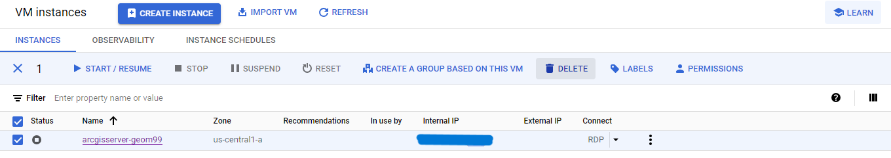
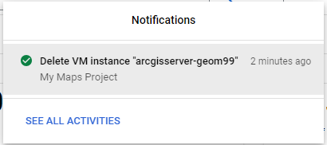
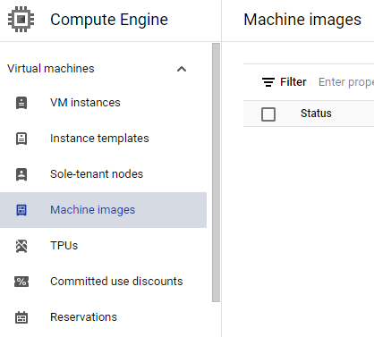
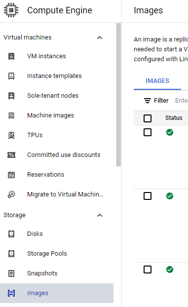

# Virtual Machine on Google Cloud Platform

In this log:

- [x] Creating a Virtual Machine on Google Gloud Platform (08/03/24 | 30 mins)
- [x] Setting Firewall Rules for Virtual Machine on Google Cloud Platform (08/03/24 | 10 mins)
- [x] How to check your ArcGIS Server Manager and REST Endpoints (08/03/24 | 5 mins)
- [x] How to Start and Stop Your Virtual Machine on Google Cloud Platform (08/03/24 | 5 mins)
- [x] How to delete your Virtual Machine on Google Cloud Platform (05/02/24 | 5 mins)
- [x] References

Total Duration: 55 mins

## Creating a Virtual Machine on Google Gloud Platform

Learn how to create and access a virtual machine on Google Cloud Platform

Expected Duration: 30 mins

### Steps

1. Visit ```https://console.cloud.google.com/```. Check that you are logged into your desired Google Account.

> [!NOTE] 
> Before proceding, click the ```hamburger button``` on the top-left corner of the page and select ```Billing```. Ensure the billing account is set to **Billing Account for Education** so that the credits are applied to the project. If no credits are being applied for this project, skip this step.

2. Click on the ```hamburger button``` on the top-left corner of the page, hover over ```Compute Engine``` and click ```VM Instances```.

3. Click ```ENABLE``` to enable the project. This might take a couple of minutes to complete. When it is complete, the page will automatically reload.

4. Click ```CREATE INSTANCE``` at the top of the page. On the VM Instance page:
    - Set the **Name** of the virtual machine
    - Select (or keep) the Region **us-central1 (Iowa)** and Zone **us-central1-a**
    - Under Machine Configuration, set it to **General purpose**, set the series to **E2**, and set the machine type to **e2-medium (2 vSPU, 1 core, 4 GB memory)**
    - Under Boot disk, click ```CHANGE```. 
        - Select ```CUSTOM IMAGES``` at the top of the page
        - Click ```CHANGE``` to change the **Source project for images**
        - Select ```ALL``` at the top of this new window and select ```Shawn's ArcGIS Server```
        - Choose the image from the dropdown menu, accept all other defaults, and click ```SELECT```
    - The Boot disk menu should be updated with your chosen image
    - Scroll down to the Firewall settings and select ```Allow HTTP traffic``` and ```Allow HTTPS traffic```
    - Accept all other defaults and click ```Create```
    - You will be redirected to the VM Instances page to wait for the VM Instance to be created. This might take a couple of minutes.

> [!TIP]
> While the VM Instance is being created, you can set the Firewall Rules.
> Details can be found below. Otherwise continue with the steps in this document, as the rules can be set later.

5. You should now see that the status of your VM Instance is checked and running, indicated with a green checkmark. 

6. Under Connect on your VM instance, click ```Set Windows password```. Enter the **Username** provided and click ```SET```.

> [!IMPORTANT]
> Copy down the password somewhere, Notepad++ is recommended.

:tada: *Congratulations! You have now completed the task of created a Virtual Machine on Google Cloud Platform!*

> [!WARNING]
> If you are stopping here, remember to STOP the virtual machine or else it will continue to run and bill to your account.
> See below for more details.


## Setting Firewall Rules for Virtual Machine on Google Cloud Platform

Learn how to create a Firewall Rule to only allow certain ports to access ArcGIS Server Manager on the GCP Virtual Machine

Assumption(s):
- You have already created a vitual machine on Google Cloud Platform

Expected Duration: 10 mins

### Steps

1. Ensure you are on the VM Instances page, which can be accessed by clicking on the ```hamburger button``` on the top-left corner of the page, hovering over ```Compute Engine``` and clicking ```VM Instances```.

2. After or while the VM Instance is being created, under Related actions, click ```Set up firewall rules```.

3. At the top of the page, click ```CREATE FIREWALL RULE```. 

4. In this new window:
    - Set the **Name** of the rule
    - Set the Direction of traffic to **Ingress**
    - Set the Action on match to **Allow**
    - Set the Targets to **All instances in the network**
    - Set the Source filter to **IPv4 ranges**
    - Set the Source IPv4 region to an **IP address** (either your own or 0.0.0.0/0 for least secure)
    - Under Protocols and ports, click ```Specified protocols and ports```, click ```TCP``` and enter **444** under Ports
    - Accept all other defaults and create the firewall rule

5. The page will automatically refresh, and you will now see your firewall rule

:tada: *Congratulations! You have now completed the task of adding a Firewall Rule to your Virtual Machine on Google Cloud Platform!*

> [!WARNING]
> If you are stopping here, remember to STOP the virtual machine or else it will continue to run and bill to your account.
> See below for more details.


## How to check your ArcGIS Server Manager and REST Endpoints

Learn how to access manager capabilities of the GCP virtual machine through ArcGIS Server Manager

Assumption(s):
- You have already created a vitual machine on Google Cloud Platform

Expected Duration: 5 mins

### Steps

1. Ensure you are on the VM Instances page, which can be accessed by clicking on the ```hamburger button``` on the top-left corner of the page, hovering over ```Compute Engine``` and clicking ```VM Instances```.

2. Copy the **External IP** address for you VM Instance.

3. Open a new window and paste the external IP address into your browser followed by **/arcgis/rest/services**. Hit ```Enter``` on your keyboard.

4. The page should now result in the REST endpoint for your server.

5. To access the ArcGIS Server Manager, type in the IP address followed by **/arcgis/manager**.

:tada: *Congratulations! You have now learned how to check the REST endpoint and ArcGIS Server Manager of your server.*


## How to Start and Stop Your Virtual Machine on Google Cloud Platform

Learn how to stop your virtual machine when it is not in use and resume it when you would like to use it again. This is an important step because you do not want unwanted charges on your account as the server will run in the background if it is not stopped.

Assumption(s):
- You have already created a vitual machine on Google Cloud Platform

Expected Duration: 5 mins

### Steps

1. When you are done using your virtual machine, click the three dots and then ```Stop```. It may take a couple of minutes for it to stop.

2. Once complete, the Status of your VM will update to a grey dot with a white 'stop' symbol in the center.

3. If you would like to start it up again, simply click the three dots and then ```Start / Resume```.

:tada: *Congratulations! You have now learned how to start and stop your virtual machine through Google Cloud Platform.*


## How to delete your Virtual Machine on Google Cloud Platform

Learn how to delete your virtual machine when you are done using it and want to stop all billing charges.

Assumptions(s):
- You have already created a virtual machine on Google Cloud Platform
- You have completed all work necessary on this virtual machine and are ready to delete it

### Steps

> [!IMPORTANT]
> Ensure your VM is not running (the status will be set to the stop icon).

1. Click the ```checkbox``` on the lefthand side of your VM to **select it**.

2. Click the ```DELETE``` button above the list of VMs.



3. When the VM is deleted, you should receive a notification confirming that action.



4. Under **Virtual machines** in the left toolbar, click ```Machine images``` and check to ensure that there are no longer any images running or being stored.



5. Under **Storage** in the left toolbar, click ```Images``` and check to ensure that there are no longer any images running or being stored.

> [!NOTE]
> In this section, you will see some default images. You do not need to delete these. Only delete the ones that are directly related to your virtual machine.



6. Browse the other tabs that your virtual machine may have added data to and ensure they are gone as well.

:tada: *Congratulations! You have now learned how to delete your virtual machine on Google Cloud Platform.*


## References

Morgan, S. [Shawn's Spotlight on GIS]. (2023, January 19). Geom99 - GCP Part 2: Creating your VM from the image [Video]. YouTube. https://www.youtube.com/watch?v=dyFeyBX9jIY